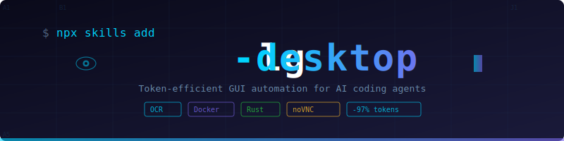

<p align="center">
  
</p>

<p align="center">
  <b>AI コーディングエージェント向け GUI 自動化スキル</b><br/>
  <a href="README.md">English</a>
</p>

---

AI コーディングエージェント向け GUI 自動化 -- スクリーンショット方式と比較して **トークン消費 97% 削減**。

スクリーンショットを毎回送信する方式（1回 765+ トークン）ではなく、OCR で画面を読み取り構造化 JSON として返す（50-200 トークン）。SHA256 ベースの変化検出と組み合わせることで、10ステップのワークフローで **約285トークン**（従来方式: **7,650+**）。

```
従来方式:     screenshot -> screenshot -> screenshot  (毎回 765+ トークン)
lg-desktop: inspect(テキスト) -> 操作 -> verify(差分)  (毎回 50-200 トークン)
```

## 概要

lg-desktop は単一のスキル（`/lg-desktop`）で、AI コーディングエージェントに Docker ベースの仮想デスクトップの操作能力を与える。[skills.sh](https://skills.sh) 経由でインストール。Claude Code、Cursor、Copilot など 35 以上のエージェントに対応。

```bash
npx skills add gyumaruya/lg-desktop
```

これだけ。初回 `/lg-desktop up` 実行時に Docker イメージが自動ビルド・起動される。

## なぜトークン効率が重要か

AI エージェントによる GUI 自動化はトークン消費が膨大になりがち。スクリーンショット1枚で 765+ トークン、典型的な自動化タスクで 10-20 回の操作が必要。

lg-desktop は **テキストファースト + 差分検出** で解決する:

| 方式 | 1操作あたり | 10ステップ | 削減率 |
|------|-----------|-----------|--------|
| 毎回スクリーンショット | 765+ トークン | 7,650+ トークン | -- |
| **lg-desktop（テキストファースト）** | **50-200 トークン** | **約285 トークン** | **約97%** |

**仕組み:**

1. **テキストファースト**: OCR が GUI 状態を座標付き構造化 JSON で返す -- 画像トークン不要
2. **変化検出**: SHA256 ハッシュでウィンドウ内容を追跡、変更箇所のみ再 OCR
3. **遅延エスカレーション**: スクリーンショットはデフォルトではなく最終手段

```
Tier 1: inspect (テキスト/JSON)     50-200 トークン  <- デフォルト
Tier 2: screenshot --crop           約200 トークン   <- OCR が曖昧な場合
Tier 3: screenshot (全体)           765+ トークン    <- 最終手段
```

## 特徴

- **テキストファースト**: OCR で GUI 状態を構造化 JSON として取得。クリック可能な要素の座標情報を含む
- **トークン 97% 削減**: 3段階エスカレーション（テキスト -> 部分スクリーンショット -> 全体スクリーンショット）
- **自己ブートストラップ**: 初回 `/lg-desktop up` で自動ビルド・起動
- **仮想デスクトップ**: Docker コンテナで Ubuntu デスクトップ（i3 WM）を実行。noVNC で Web ブラウザからアクセス可能
- **グリッド座標**: 10x10 グリッドオーバーレイ（A1-J10）で直感的な座標指定
- **変化検出**: SHA256 ハッシュで変更のあったウィンドウのみ OCR を実行

## アーキテクチャ

```
AI コーディングエージェント
  |
  |  /lg-desktop <action>
  |
  v
lg-desktop スキル (SKILL.md)
  |
  |  docker exec
  |
  v
lg-desktop コンテナ (Ubuntu 24.04)
  +-- Xvfb (仮想ディスプレイ)
  +-- i3 WM (ウィンドウマネージャ)
  +-- noVNC (Web UI: localhost:3000)
  +-- lg-inspect (OCR + JSON 状態取得)
  +-- lg-grid (グリッドオーバーレイ生成)
  +-- xdotool / wmctrl (自動化ツール)
  +-- tesseract (OCR エンジン)
```

## インストール

### 前提条件

- Docker (Docker Compose を含む)
- [skills.sh](https://skills.sh) 対応の AI コーディングエージェント

### インストール

```bash
npx skills add gyumaruya/lg-desktop
```

### アンインストール

```bash
npx skills remove --skill lg-desktop
docker rm -f lg-desktop 2>/dev/null
docker rmi lg-desktop 2>/dev/null
```

## クイックスタート

```
# デスクトップを起動（初回は自動ブートストラップ）
/lg-desktop up

# デスクトップ状態を検査（OCR）
/lg-desktop inspect

# スクリーンショットを取得
/lg-desktop screenshot

# グリッド座標 E5 をクリック
/lg-desktop click E5

# テキストを入力
/lg-desktop type "Hello World"

# キーボードショートカット
/lg-desktop key ctrl+s

# テキストを探してクリック
/lg-desktop find-and-click "OK"

# デスクトップを停止
/lg-desktop down
```

## スキルリファレンス

### /lg-desktop

単一スキルにサブコマンドを統合:

**ライフサイクル:**
```
/lg-desktop up            # 起動（初回は自動ブートストラップ）
/lg-desktop down          # 停止
/lg-desktop status        # 状態確認
/lg-desktop update        # 最新版に更新+再ビルド
```

**検査:**
```
/lg-desktop inspect                # 全ウィンドウ検査
/lg-desktop inspect --changes-only # 変更のあったウィンドウのみ
```

出力例:
```json
{
  "timestamp": "2025-02-12T10:30:00Z",
  "desktop_size": [1280, 1024],
  "focused_window": "0x1234567",
  "windows": [
    {
      "id": "0x1234567",
      "title": "Terminal",
      "geometry": {"x": 0, "y": 0, "w": 640, "h": 512},
      "ocr_text": "user@host:~$ _",
      "elements": [
        {
          "text": "user@host",
          "x": 10, "y": 20, "w": 80, "h": 15,
          "confidence": 95.0
        }
      ],
      "changed": true
    }
  ],
  "changes_since_last": ["0x1234567"]
}
```

**クリック:**
```
/lg-desktop click A5        # グリッド座標
/lg-desktop click 500,300   # ピクセル座標
```

**テキスト入力:**
```
/lg-desktop type "Hello World"
```

**キーボード操作:**
```
/lg-desktop key Return
/lg-desktop key ctrl+s
/lg-desktop key alt+F4
```

**スクリーンショット:**
```
/lg-desktop screenshot                # 基本
/lg-desktop screenshot --grid         # グリッド付き
/lg-desktop screenshot --crop 100,200,300,400  # 領域切り出し
```

**テキスト検索+クリック:**
```
/lg-desktop find-and-click "OK button"
```

**待機:**
```
/lg-desktop wait-for --window "Firefox"
/lg-desktop wait-for --text "Loading complete"
/lg-desktop wait-for --gone "Please wait..."
```

**アサーション:**
```
/lg-desktop assert --window "Settings"
/lg-desktop assert --no-window "Error"
/lg-desktop assert --text "Success"
```

**コマンド実行:**
```
/lg-desktop run xterm
```

**ファイルコピー:**
```
/lg-desktop copy-from /tmp/output.txt ./output.txt
/lg-desktop copy-to ./input.txt /tmp/input.txt
```

## 技術詳細

### コンテナ仕様

| コンポーネント | 詳細 |
|---------------|------|
| ベースイメージ | Ubuntu 24.04 |
| ディスプレイサーバー | Xvfb (仮想フレームバッファ) |
| ウィンドウマネージャ | i3 (タイリング、OCR最適化設定) |
| VNC サーバー | x11vnc + noVNC (Web インターフェース) |
| 解像度 | 1280x1024 (変更可能) |
| OCR エンジン | Tesseract (英語 + 日本語) |

### バイナリ

Linux musl 静的リンクでコンパイルされた2つの Rust バイナリ:

- **lg-inspect**: OCR ベースのデスクトップ状態検査 + SHA256 変化検出
- **lg-grid**: 10x10 グリッドオーバーレイ生成

### 共有ディレクトリ

コンテナは `/tmp/lg-desktop-share`（ホスト）を `/shared`（コンテナ）にマウント:
- 状態永続化 (`lg-state.json`)
- スクリーンショット保存
- ホスト-コンテナ間のファイル交換

## 応用

### カスタムレシピ

`docker/recipes/` にレシピを作成:

```bash
#!/bin/bash
# recipe: open-firefox
xdotool key alt+Return
sleep 0.3
xdotool type --clearmodifiers "firefox"
xdotool key Return
sleep 2
lg-inspect --changes-only
```

実行:
```
/lg-desktop run /usr/local/lib/lg-recipes/open-firefox.sh
```

### Java SWT アプリケーション

Java SWT アプリ（Eclipse 等）では xdotool の `--window` フラグを使用:

```bash
WID=$(wmctrl -l | grep "Eclipse" | awk '{print $1}')
xdotool mousemove --sync --window $WID 500 300 click 1
```

### 変化検出

lg-inspect は SHA256 ハッシュでウィンドウの変化を検出:
- 初回実行: 全ウィンドウを OCR
- 2回目以降: 内容が変わったウィンドウのみ OCR
- `--changes-only` フラグで変化のあったウィンドウのみ JSON 出力

## トラブルシューティング

### デスクトップが起動しない

```bash
docker info                    # Docker の確認
docker logs lg-desktop         # コンテナログの確認

# リビルド (スキル経由)
/lg-desktop down
/lg-desktop up
```

### OCR が動かない

```bash
docker exec lg-desktop tesseract --version
docker exec -e DISPLAY=:1 lg-desktop scrot /tmp/test.png
docker exec lg-desktop tesseract /tmp/test.png stdout
```

### クリックが効かない

- まずウィンドウにフォーカス: `xdotool windowfocus --sync <WID>`
- Java SWT アプリは `--window` フラグを使う
- 操作間のスリープ時間を増やす
- `screenshot --grid` で座標を確認

## パフォーマンス

操作あたりの典型的なトークン消費:

| 方式 | トークン数 |
|------|-----------|
| inspect (全体) | 100-200 |
| inspect --changes-only | 30-80 |
| wmctrl -l (確認) | 15-30 |
| screenshot (全体) | 765+ |
| screenshot --crop | 200-400 |

10ステップの自動化の例:
- 1回の全体inspect + 9回の変更のみ確認: 約285トークン
- 従来方式（10回スクリーンショット）: 7650+トークン
- **約96%削減**

## コントリビュート

1. リポジトリをフォーク
2. フィーチャーブランチを作成
3. 変更を実装
4. `cargo test` と `cargo clippy` でテスト
5. プルリクエストを送信

## ライセンス

MIT License - 詳細は [LICENSE](LICENSE) を参照。

## 謝辞

- [RushValley](https://github.com/gyumaruya/RushValley) - AI エージェント身体化プロジェクトから抽出
- Rust, Docker, Tesseract, noVNC で構築

## リンク

- **リポジトリ**: https://github.com/gyumaruya/lg-desktop
- **Issues**: https://github.com/gyumaruya/lg-desktop/issues
- **skills.sh**: https://skills.sh
